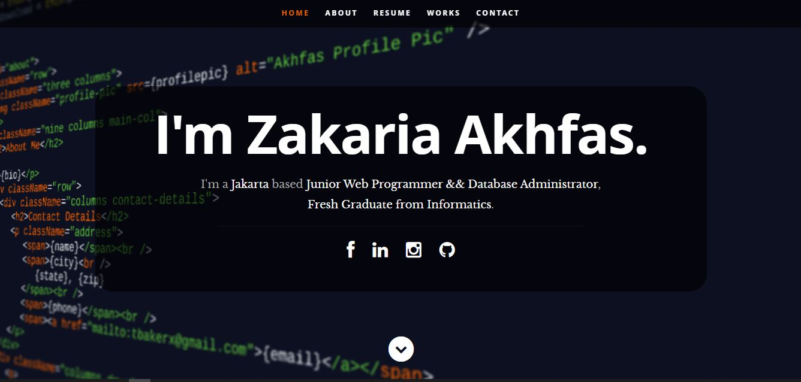

<h1 align="center"> Portfolio Template 🔥 </h1> 

<p align="center">
  <a href="https://nodejs.org/en/blog/release/v12.13.0/"></a>
  <a href="https://www.npmjs.com/package/npm/v/6.13.4"></a>
  <a href="https://reactjs.org/"></a>
  <a href="https://akhfas-portfolio-simple.netlify.app/"></a>
</p>

<p align="center"> 
    </img>
</p>

✔️ Ringkasan dan Tentang Saya\
✔️ Keterampilan \
✔️ Pengalaman\
✔️ Pendidikan\
✔️ Kontak saya

Untuk melihat contoh langsung, **[click here](https://akhfas-portfolio-simple.netlify.app/)**

# Clone dan Gunakan 📋
- Jika Anda ingin membantu mengembangkannya atau hanya menyimpannya, Anda dapat melakukan fork repositori hanya dengan mengklik tombol di sudut kanan atas halaman ini.
- Clone repositori perintah di bawah ini:
  - ```python
     git clone https://github.com/akhfasarrofi/portfoliosimple.git
    ```
- Untuk mengunduh dependensi yang diperlukan ke sistem anda jalankan perintah berikut:
  - ```python
    npm install
    ```
- Sekarang, proyek tersebut siap digunakan.
- Anda dapat memeriksanya menggunakan `npm start`, ini akan membuka situs web secara lokal di browser Anda.

# Sesuaikan dengan portofolio Anda sendiri ✏️

Dalam proyek ini, pada dasarnya ada 1 hal yang perlu Anda ubah untuk menyesuaikannya **resumeData.json**.

### resumeData.json

Anda akan menemukan file `public/resumeData.json` yang berisi informasi lengkap tentang pengguna. File tersebut terlihat seperti di bawah ini:

```python
{
    "name": "Zakaria Akhfas",
    "occupation": "Junior Web Programmer && Database Administrator",
    "description": "",
    "employer": "",
    "jobDescription": "Fresh Graduate from Informatics",
    "image": "profile_pic.jpg"
...
```
Anda dapat mengubah informasi pribadi, pengalaman, pendidikan, media sosial, informasi kontak, dll. Di `public/resumeData.json`.

# Deployment 📦

- Setelah Anda selesai dengan pengaturan Anda dan telah berhasil menyelesaikan semua langkah di atas, Anda harus membuat situs web Anda online!
- Saya sangat merekomendasikan menggunakan [Netlify](https://www.netlify.com/) CARA TERMUDAH.
- Sekarang, Anda perlu membuat produksi dan menerapkannya di situs web.

